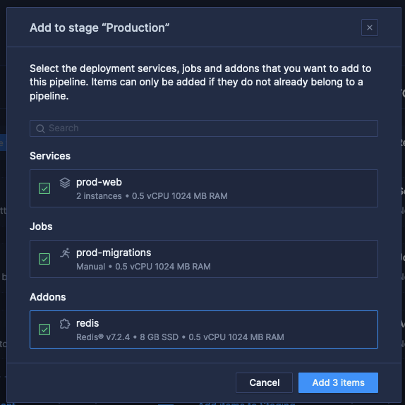
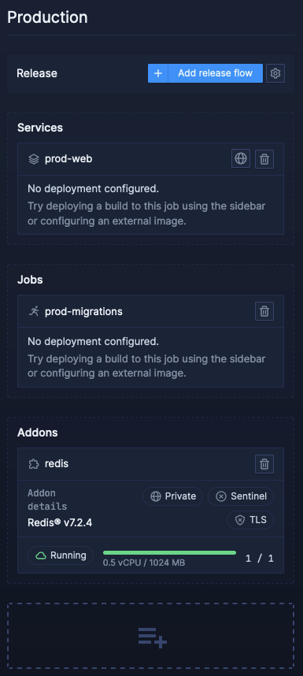

1. Setup accounts (5 minutes)
    - Create a Northflank account
        - Select Developer sandbox plan on team creation
        - Navigate to https://app.northflank.com/s/account/billing/claim-coupon and enter coupon AUSNAV-WS
        - no payment information required for Workshop
    - Create a Civo account - no payment information required for Workshop
    -   https://www.civo.com/seminar-signup
2. Create BYOC Cluster for Civo
    - Generate Civo API Key https://dashboard.civo.com/security
    - https://app.northflank.com/s/account/cloud/clusters/new/civo
3. Create two repositories
    - Application repository 
        - https://github.com/northflank-civo/webapp-with-redis
    - GitOps repository
        - https://github.com/northflank-civo/gitops-northflank
4. Link Northflank account with GitHub App
    - https://app.northflank.com/s/account/integrations/vcs
    - Create a template for production
        - https://app.northflank.com/s/account/templates
        - Enable GitOps and select the GitHub repository `gitops-northflank`
        - Set template to create a project
        - Select Bring your Own Cloud and the Civo cluster we just created
        - Update the repositories in the template for the build services (`prod-builder` and `preview-builder`)
    - Run the template
5. Create pipeline
    - Add the `prod-web` service and the `redis` addon to the production stage
      
      
      
    - Add release flow ton the production stage

      
    - Configure the release flow to use GitOps

      
    - Create preview environment via pipeline
6. Create a PR
    - Preview environment
    - Merge PR to show fully end-to-end lifecycle management
7. Optional todos after:
    - Invite colleagues for multiplayer DevOps
    - Customize template with new micro-services and databases
    - Setup billing or use free developer tier
